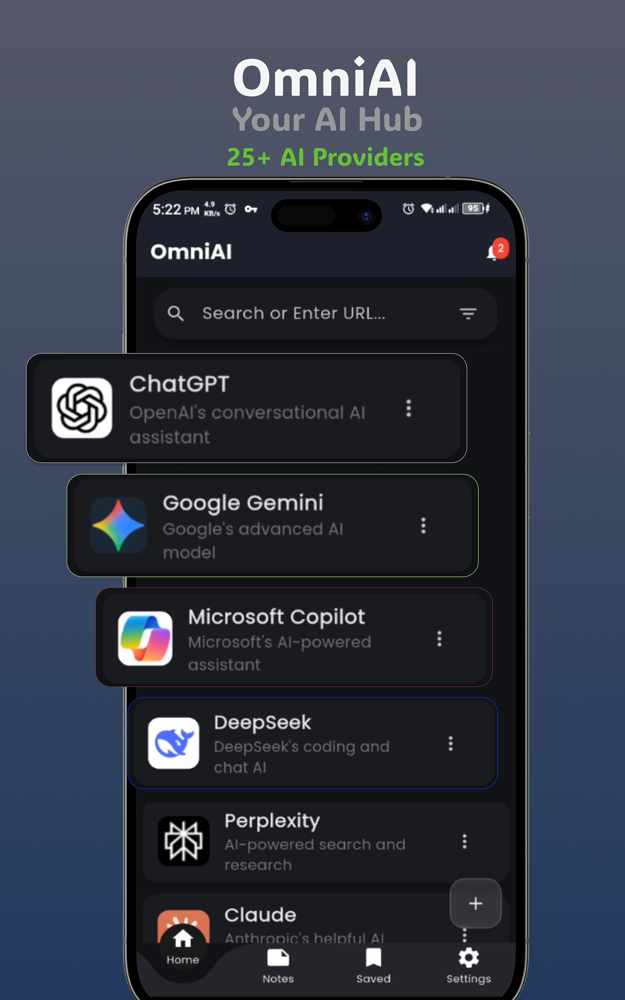
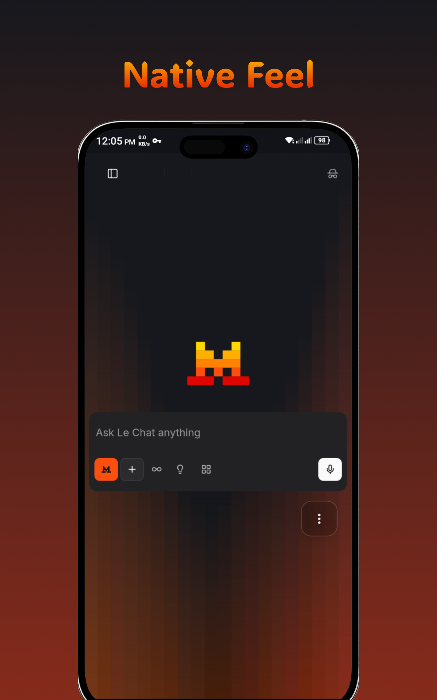
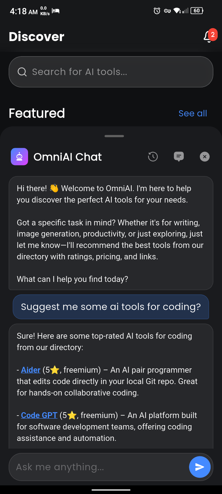
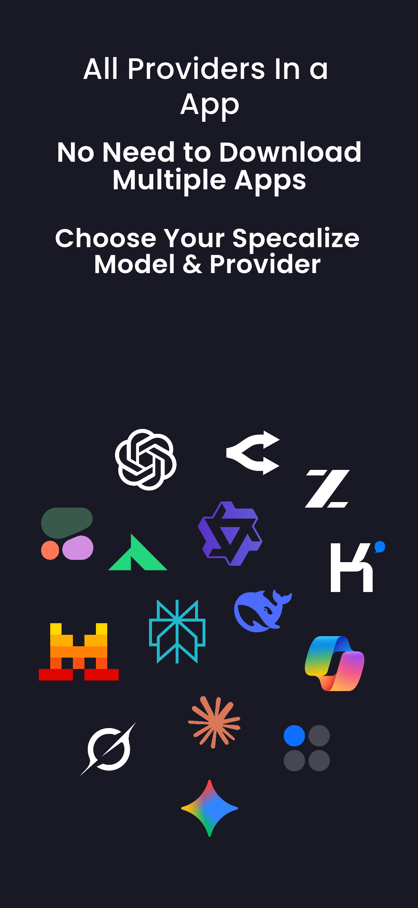
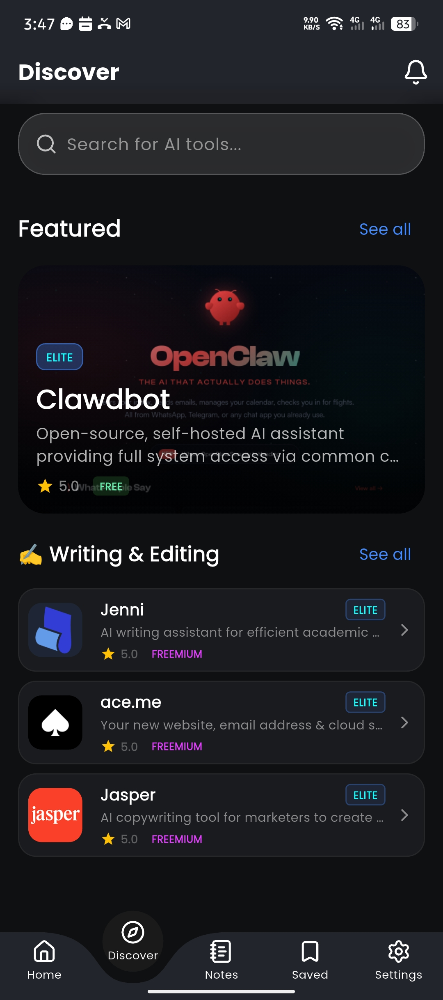
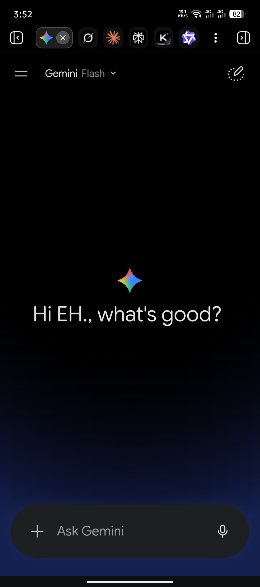
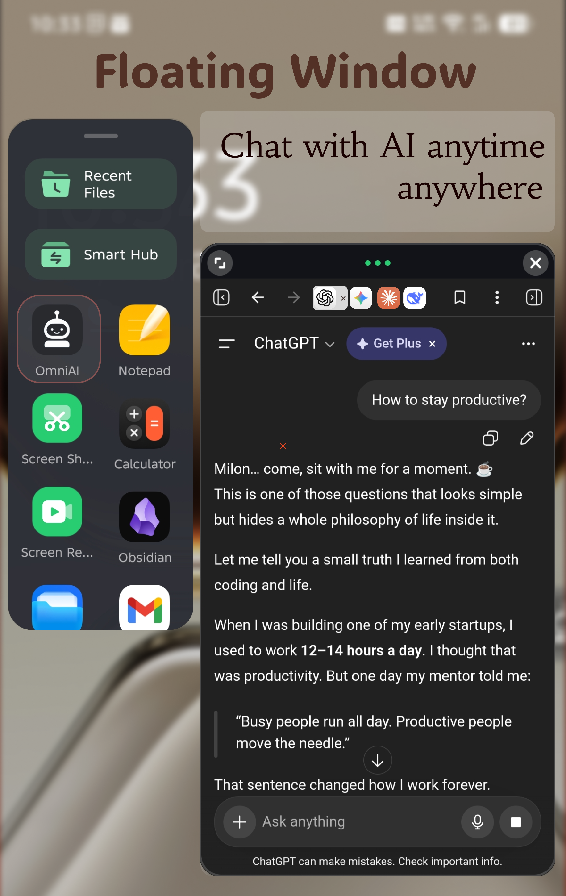

  
  <h1>OmniAI</h1>
  <h3>Your All-in-One AI Assistant Hub</h3>
  

    <strong>25+ AI Platforms · 5,000+ AI Tools · Built-in Notebook · Smart Features</strong>
  

  

    
  

   
  

    
    
    
  

 

## About

OmniAI brings together the world's leading AI platforms in one seamless experience. No more juggling multiple apps, accounts, or tabs — everything you need is right here.

Whether you use ChatGPT, Gemini, Claude, DeepSeek, Perplexity, or any other AI service, OmniAI gives you instant access to all of them through a clean, intuitive interface.

 

## Features

<table>
<tr>
<td width="50%" valign="top">

### 🤖 25+ AI Providers
Access ChatGPT, Gemini, Claude, DeepSeek, Perplexity, Copilot, Grok, Mistral, Qwen, and more — all in one app.

</td>
<td width="50%" valign="top">

### 🔍 Discover 5,000+ AI Tools
Browse and discover thousands of AI tools from across the web, categorized and ready to use.

</td>
</tr>
<tr>
<td width="50%" valign="top">

### 📝 Built-in Notebook
Take notes while reading AI responses. Highlight, select, and save text instantly without leaving the app.

</td>
<td width="50%" valign="top">

### 🎨 Smart Text Selection
Select any text and get a contextual toolbar: Copy, Highlight, Add to Notes, or Share. Seamless workflow.

</td>
</tr>
<tr>
<td width="50%" valign="top">

### ⚡ AI News & Updates
Stay ahead with daily AI news, trends, and notifications delivered straight to your feed.

</td>
<td width="50%" valign="top">

### 🧩 Custom Providers
Add your own AI services. OmniAI is not limited to our curated list — bring your own.

</td>
</tr>
<tr>
<td width="50%" valign="top">

### 📌 Bookmarks
Save your favorite AI tools and conversations with auto-fetched favicons for quick recognition.

</td>
<td width="50%" valign="top">

### 🎯 Organize Your Way
Reorder your AI providers in any order you prefer. Your list, your priority.

</td>
</tr>
<tr>
<td width="50%" valign="top">

### 🌙 Beautiful Design
Material Design 3 with glassmorphism effects, dynamic colors per provider, and full dark theme support.

</td>
<td width="50%" valign="top">

### 🔒 Privacy First
Local data storage, cache management, and full control over your data. No unnecessary permissions.

</td>
</tr>
</table>

 

## Screenshots

  
  
  
  

  
  
  

 

## Why OmniAI?

| Instead of... | OmniAI gives you... |
|---|---|
| Installing 10 different AI apps | One app with 25+ providers |
| Managing multiple accounts & logins | Unified access to every platform |
| Switching between tabs constantly | Seamless in-app experience |
| Missing out on new AI tools | Discover 5,000+ tools curated daily |
| Forgetting what you learned | Built-in notebook & highlights |

 

## Supported Providers

ChatGPT · Google Gemini · Claude (Anthropic) · DeepSeek · Perplexity · Microsoft Copilot · DuckDuckGo AI Chat · Qwen (Alibaba) · Grok (xAI) · Mistral AI · Kimi (Moonshot) · Together.ai · Open Router · Cohere Coral · Z AI · Poe · ChatGPT Free · Easemate AI · ChatbotAI · Hix Chatbot · Gening AI · DeepAI Chat · Stable Diffusion · Leonardo AI · Flat AI · Blackbox AI · ZZZCode AI · You Web Search · Google AI Studio · Galaxy AI Chat · Big AGI · Notion · NoteBook LM · Hugging Face · And many more

 

  
<strong>Download OmniAI today — free on Google Play.</strong>

  
No account required. No hidden fees.

   
  

