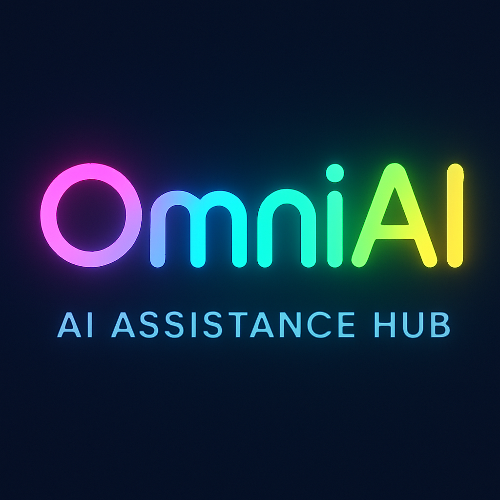

# 🧠 OmniAI — AI Assistance Hub

<p align="center">
  
</p>

<p align="center">
  <em>Your universal gateway to Artificial Intelligence — one app, infinite possibilities.</em>
</p>

<p align="center">
  <a href="https://play.google.com/store/apps/details?id=com.ai.omniai">
    
  </a>
  <a href="https://github.com/EHMilon/OmniAI-Git">
    
  </a>
  
</p>

---

## 🌐 The OmniAI Ecosystem

OmniAI isn't just an app — it's a **multi-platform AI ecosystem** built from interconnected components:

```
                    ┌──────────────────────────────────────────┐
                    │         OMNIAI FLUTTER APP              │
                    │  (Google Play / omniai_app/)            │
                    │  v1.3.5 · 20+ AI Providers · WebView   │
                    │  Notes · Bookmarks · Tabs · Discover   │
                    └──────────────┬──────────────────────────┘
                                   │ reads provider.json
                                   ▼
┌──────────────────────────────────────────────────────────────────┐
│              OmniAI-Git/   ←── YOU ARE HERE                       │
│  ├── provider.json         (AI provider catalog — 748+ tools)    │
│  ├── lib/provider-list.dart (Dart definitions for the app)        │
│  ├── privacy_policy.md                                            │
│  └── assets/                (screenshots, images)                 │
└──────┬───────────────────────────────────────────────────────────┘
       │                    │                    │
       ▼                    ▼                    ▼
┌──────────────┐   ┌──────────────┐   ┌──────────────────┐
│   BACKEND    │   │   FRONTEND   │   │ ADMIN DASHBOARD  │
│  FastAPI     │   │  Next.js     │   │  Next.js          │
│  :8000       │   │  :3000       │   │  :3001            │
│  API + SQLite│   │  Public Site │   │  Management       │
│  Alpha       │   │  Alpha       │   │  Alpha            │
└──────────────┘   └──────────────┘   └──────────────────┘
```

## 🤔 What is OmniAI?

OmniAI is a **Flutter mobile application** that serves as a unified interface to **20+ AI platforms** including:
ChatGPT, Claude, Google Gemini, Perplexity, DeepSeek, Midjourney, Runway, Suno, and many more.

**Key Features:**
- 🚀 **One-tap access** to all major AI services via WebView
- 📝 **Built-in Notes** system (syncs across devices)
- 🔖 **Bookmark** your favorite AI tools
- 📑 **Multi-tab** browsing — use multiple AIs side-by-side
- 🔍 **Discover** new AI tools from the directory (Beta)
- 🎨 **Material Design 3** with glassmorphism UI
- 🔒 **Privacy-first** — zero data collection

**[Download on Google Play](https://play.google.com/store/apps/details?id=com.ai.omniai)**

---

## 🏗️ System Architecture (For AI Agents)

### 1. `omniai_app/` — Flutter Mobile App
**Status:** Beta on Google Play · **Tech:** Flutter + Riverpod + flutter_inappwebview

| Module | Path | Purpose |
|---|---|---|
| WebView Core | `lib/` | Renders AI provider websites in-app |
| Provider List | `OmniAI-Git/provider.json` → app cache | Source of truth for all 20+ providers |
| Notes | In-app SQLite via Hive | User-created notes with sync |
| Discover | Reads backend API (Alpha) | Browse new AI tools from directory |

**Dependencies:** Reads `provider.json` from OmniAI-Git, optionally reads backend API for Discover

---

### 2. `backend/` — FastAPI Backend
**Status:** Alpha · **Tech:** Python FastAPI + SQLAlchemy + SQLite

| Endpoint Group | Purpose |
|---|---|
| `/api/tools` | AI tools directory CRUD (list, search, filter) |
| `/api/categories` | 22 categories for tool classification |
| `/api/featured`, `/api/trending`, `/api/popular` | Curated home page sections |
| `/api/admin/*` | Full admin CRUD for tools, categories, notifications |
| `/health` | Health check |

**Data Source:** `backend/data/discover_provider.json` — seeded from Toolify.ai crawl (748 tools across 6 main categories → 22 subcategories)

**Connects to:** frontend-web, admin-dashboard, omniai_app (Discover)

---

### 3. `frontend-web/` — Next.js Public Site
**Status:** Alpha · **Tech:** Next.js 14 + TypeScript + Tailwind CSS

| Page | Purpose |
|---|---|
| `/` | Home — featured, trending, popular tools |
| `/category/[handle]` | Browse tools by category |
| `/tool/[handle]` | Single tool detail |
| `/search` | Full-text search |
| `/submit` | Submit a new AI tool |

**Dependencies:** Consumes `backend` API at `/api/*`

---

### 4. `admin-dashboard/` — Admin Console
**Status:** Alpha · **Tech:** Next.js 14 + TypeScript + Recharts

| Page | Purpose |
|---|---|
| `/` (Overview) | Dashboard stats, charts, quick actions |
| `/tools` | Full CRUD — add, edit, delete tools |
| `/categories` | Manage 22 categories with icons |
| `/submissions` | Approve/reject tool submissions |
| `/analytics` | Usage analytics, rating distribution |
| `/notifications` | Compose and send push notifications |
| `/health` | Live endpoint monitoring (auto-refresh 30s) |

**Dependencies:** Consumes `backend` API at `/api/admin/*`

---

### 5. `OmniAI-Git/` — Provider Data Repository
**Status:** Stable · **Purpose:** Single source of truth for AI provider metadata

| File | Purpose |
|---|---|
| `provider.json` | Provider catalog — name, URL, logo, category |
| `lib/provider-list.dart` | Dart definitions used by Flutter app |
| `assets/` | Screenshots, app icons |
| `privacy_policy.md` | App privacy policy |
| `readme.md` | This file |

---

## 🔄 Data Flow

```
                    OMNIAI APP (Flutter)
                    ├── Reads provider.json (shipped with app)
                    ├── Shows WebViews for each provider
                    └── Discover tab → Backend API (Alpha)

                    BACKEND (FastAPI)
                    ├── Seeded from discover_provider.json
                    ├── Serves /api/tools, /api/categories
                    └── Serves /api/admin/* for management

                    FRONTEND (Next.js :3000)
                    ├── Fetches /api/* from Backend
                    └── Renders public AI tools directory

                    DASHBOARD (Next.js :3001)
                    ├── Fetches /api/admin/* from Backend
                    └── Manages tools, categories, users
```

---

## 🚀 Quick Start (Development)

```bash
# 1. Backend (port 8000)
cd omn ai_app/backend
source venv/bin/activate
uvicorn app.main:app --reload --port 8000

# 2. Frontend (port 3000)
cd omn ai_app/frontend-web
npm run dev

# 3. Admin Dashboard (port 3001)
cd omn ai_app/admin-dashboard
npm run dev
```

---

## 🔮 Future Roadmap

| Phase | Feature | Status |
|---|---|---|
| **P0** | User authentication (Google, email) | 📝 Planned |
| **P1** | Premium subscription system | 📝 Planned |
| **P2** | AI-powered search (RAG/embeddings) | 📝 Planned |
| **P3** | Multi-language support | 📝 Planned |
| **P4** | PostgreSQL migration | 📝 Planned |
| **P5** | Rate limiting & caching (Redis) | 📝 Planned |

---

## 🧠 AI Agent Memory Guidelines

This project is built for AI-agent-assisted development. To maintain context across sessions:

1. **Architecture:** See system diagram above — all 5 components interconnect
2. **Data Source:** `discover_provider.json` → seeds SQLite → served via API
3. **Provider Data:** `OmniAI-Git/provider.json` is the app's source of truth
4. **Discover (Beta):** The app's Discover tab consumes the backend API
5. **Admin vs User:** Backend serves both public (`/api/tools`) and admin (`/api/admin/*`) endpoints

When making changes, always check:
- Does this affect the data flow chain?
- Does this break the Flutter app's Discover feature?
- Does this require updating `provider.json` or database schema?

---

## 📄 License

See [privacy_policy.md](privacy_policy.md) for privacy information.
