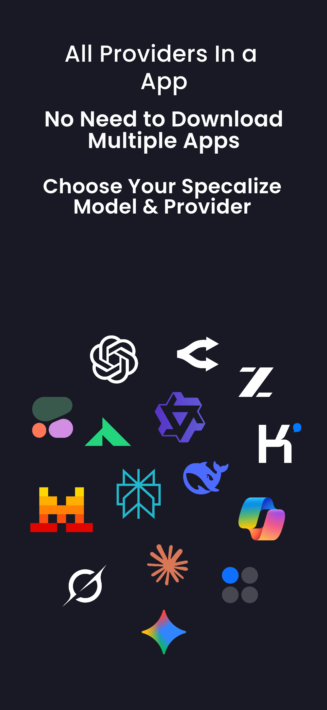

# OmniAI - AI Assistance Hub

  

  
  
  
  

## Overview

OmniAI is a comprehensive Flutter application designed to be your central hub for various Artificial Intelligence functionalities. This project aims to provide a seamless and integrated experience for interacting with different AI services and tools, all within a single, intuitive application.

With OmniAI, you can access popular AI platforms like ChatGPT, Claude, Google Gemini, Perplexity, and many more through a unified interface. The app features a beautiful Material Design 3 interface with glassmorphism effects, making it both visually appealing and highly functional.

## Screenshots

  
  
  
  

## Key Features

### 🤖 AI Platform Integration
- Access to 20+ popular AI platforms including:
  - ChatGPT
  - Claude
  - Google Gemini
  - Perplexity
  - Microsoft Copilot
  - DuckDuckGo AI Chat
  - Kimi
  - Qwen
  - DeepSeek
  - Grok
  - And many more...
- Custom AI provider support - Add your own AI services
- Reorder providers based on your preference

### 🖥️ Advanced WebView Experience
- Desktop mode toggle for better compatibility
- JavaScript enabled for full functionality
- Pull-to-refresh for easy page reloading
- Clear cache and cookies options
- Permission management for camera and microphone

### 🎨 Beautiful UI/UX
- Material Design 3 with glassmorphism effects
- Dark and light theme support
- Smooth animations and transitions
- Intuitive navigation and organization

### 🔐 Privacy & Security
- Local data storage
- Clear all data option
- Cache management
- Cookie handling

### ⚙️ Customization
- Desktop mode toggle
- JavaScript enable/disable
- Clear cache on exit option
- Reset providers to default

  

